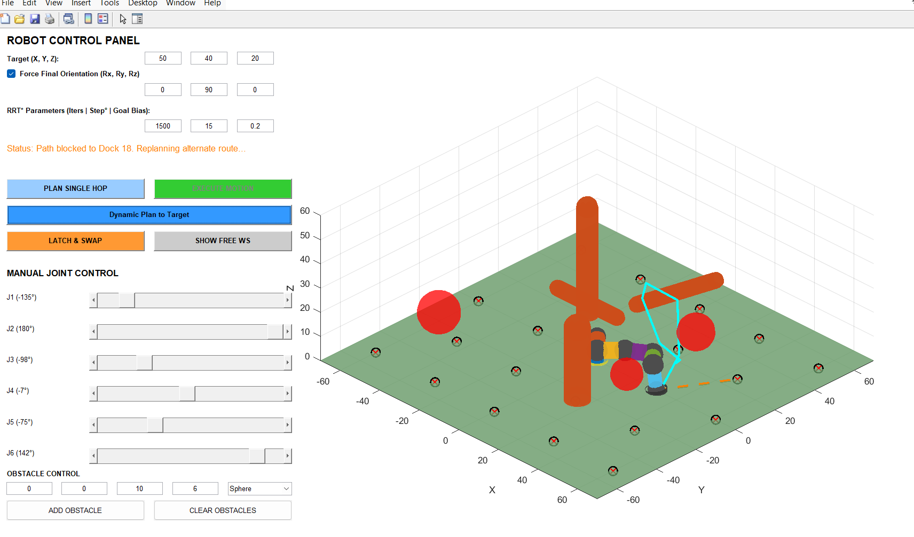
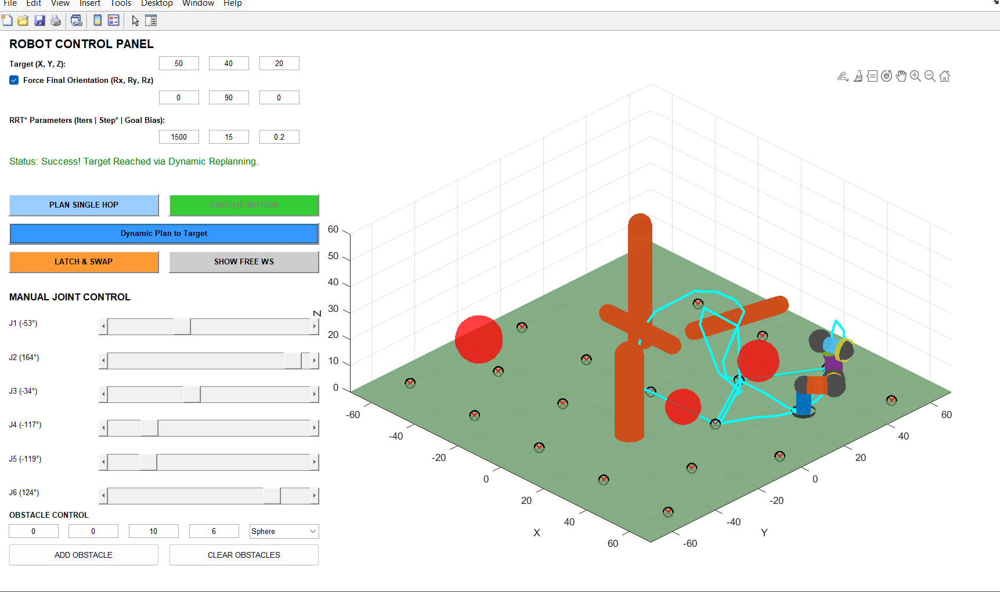

# 🦾 Interactive 6-DOF Brachiating Robot Simulation

> **MATLAB simulation of a 6-DOF robot arm that locomotes across a hexagonal docking grid using RRT* path planning, inverse kinematics, and dynamic obstacle avoidance.**

---

## 📸 Snapshots

### Mid-Execution — Route Replanning Around Obstacles

*The planner detects a blocked path to Dock 18 and dynamically computes an alternate route through the hexagonal grid.*

### Final State — Target Reached via Dynamic Replanning

*The robot successfully reaches the target at (50, 40, 20) after multi-hop brachiating across the grid, with the full end-effector trace shown in cyan.*

---

## ✨ Features

- **Brachiating locomotion** — the robot alternates its base joint across a hexagonal docking grid, simulating hand-over-hand movement
- **RRT\* path planning** — collision-free joint-space paths using an L6-norm RRT\* planner with rewiring
- **Multi-seed Inverse Kinematics** — `fminsearch`-based IK with 20+ random seeds and optional orientation forcing
- **A\* global routing** — graph-search over the docking grid with dynamic edge blocking and replanning
- **Full collision detection** — capsule–capsule, point–capsule, capsule–AABB (boxes), and self-collision checking
- **Dynamic obstacles** — add/clear spheres, cylinders, and boxes at runtime via the UI
- **Predefined environment** — static spheres and capsule obstacles included out of the box
- **Manual joint control** — 6 sliders for direct kinematic manipulation with live collision warning
- **Free workspace visualisation** — scatter 5000 random valid configurations to see the reachable workspace
- **End-effector trace** — cyan trajectory trail rendered throughout execution

---

## 🚀 Getting Started

### Requirements
- MATLAB R2020b or later (no additional toolboxes required)

### Run

```matlab
interactive_6dof_robot
```

That's it — the full GUI launches immediately.

---

## 🕹️ UI Guide

| Control | Description |
|---|---|
| **Target (X, Y, Z)** | Cartesian goal for the end-effector |
| **Force Final Orientation** | Toggle + Rx/Ry/Rz angles to constrain end-effector orientation |
| **RRT\* Parameters** | Iterations, step size (°), goal bias probability |
| **PLAN SINGLE HOP** | IK + RRT\* for a direct single move |
| **EXECUTE MOTION** | Animate the planned path |
| **Dynamic Plan to Target** | Full multi-hop brachiating sequence with auto-replanning |
| **LATCH & SWAP** | Flip the base joint (end-effector becomes new base) |
| **SHOW FREE WS** | Sample and visualise the collision-free workspace |
| **ADD / CLEAR OBSTACLES** | Place spheres, cylinders, or boxes dynamically |
| **Joint sliders** | Manually drive each of the 6 joints |

---

## 🔧 Architecture

```
interactive_6dof_robot.m
│
├── Kinematics
│   ├── compute_Ti()          — DH transform per joint (Craig convention)
│   ├── getForwardKinematics() — full FK with global base transform
│   └── solveIK()             — multi-seed fminsearch IK
│
├── Planning
│   ├── planRRTStar()         — RRT* with L6 norm and rewiring
│   └── findGlobalRoute()     — A* over hexagonal docking grid
│
├── Collision
│   ├── checkCollisions()     — dispatches all collision types
│   ├── dist3D_Point_to_Segment()
│   ├── dist3D_Segment_to_Segment()
│   └── dist3D_Segment_to_AABB()
│
└── Rendering
    ├── updatePlot()
    ├── drawCylinder_between_points()
    ├── drawLatch()
    ├── drawHub()
    └── drawBox()
```

---

## 📐 DH Parameters

| Joint | a (mm) | α (°) | d (mm) |
|-------|--------|-------|--------|
| 1 | 0 | 0 | 10 |
| 2 | 0 | −90 | 10 |
| 3 | 10 | 0 | 0 |
| 4 | 0 | −90 | 10 |
| 5 | 0 | +90 | 10 |
| 6 | 0 | −90 | 10 |

Craig's convention. All joint angles initialise to `[0, −30, 0, 0, 0, 0]°`.

---

## 🧠 How Brachiating Works

1. The robot starts with **Joint 1 as base**, latched to a docking point on the ground plane.
2. **IK** solves for the end-effector (Joint 6) to reach the next docking point.
3. **RRT\*** finds a collision-free joint-space path.
4. On arrival, **LATCH & SWAP** flips the kinematic chain — Joint 6 becomes the new base, Joint 1 becomes the free end-effector.
5. Steps 2–4 repeat hop by hop, guided by **A\*** routing over the hexagonal grid.
6. If a hop is blocked, the planner marks the edge and reruns A\* for an alternate route.

---

## 📁 File Structure

```
interactive_6dof_robot.m   ← single self-contained MATLAB script
README.md
docs/
  snapshot1.png            ← mid-execution replanning screenshot
  snapshot2.png            ← successful target-reached screenshot
DOCUMENTATION.md           ← full technical documentation
```

---

## 👤 Author

**Rudranarayan** — Mechanical Engineering, IIT Kharagpur

---

## 📄 License

Apache License

